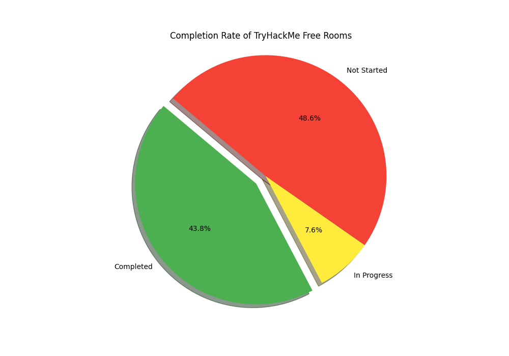

# TryHackMe Room Progress Tracker 🚀

This project fetches and visualizes the progress of completed rooms on TryHackMe for a given user. It uses the TryHackMe API to retrieve the data, processes it, and generates a pie chart showing the overall progress. Additionally, it saves the sorted progress data to a JSON file and the pie chart to an image file.

<p align="center">
  
</p>

## Requirements 📋

- Python 3.x
- `requests` library
- `matplotlib` library

## Installation 🛠️

1. **Clone the Repository**

    ```bash
    git clone https://github.com/pentestfunctions/tryhackme_progress.git
    cd tryhackme_progress
    ```

2. **Install Required Libraries**

    You can install the required libraries using `pip`:

    ```bash
    pip install requests matplotlib
    ```

## Usage 🚦

1. **Modify the Connect.sid (Cookie)**

    Update the `cookie on line 5` parameter in the thmprogress.py script (Get your connect.sid cookie from THM)

  ```python  
  cookie = "RANDOM_SID"
  ```

2. **Run the Script**

    Execute the script to fetch data, process it, and generate the pie chart:

    ```bash
    python thmprogress.py
    ```

3. **Output Files**

    - `progress_data_sorted.json`: Contains the sorted progress data.
    - `progress_pie_chart.png`: Contains the pie chart image showing the progress.
